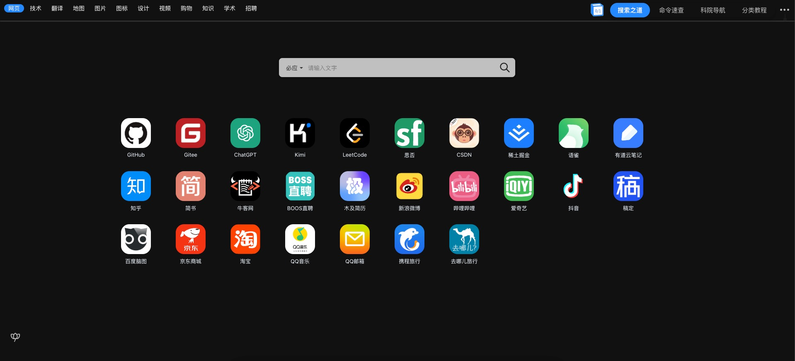

# yuanjing-nav-crx-website 

This is a yuanjing-nav-crx website for [Next.js](https://nextjs.org/) 14 App Router. 

## Built Using and Initialised with ⚒️
- Tailwind CSS
- [Shadcn](https://ui.shadcn.com/) Components + Themes
- Custom Components and Layouts that are fully responsive in both Mobile and Desktop View
- Vercel's [Geist Font](https://vercel.com/font)

## Preview


## Getting Started

First, run the development server:

```bash
npm run dev
# or
yarn dev
# or
pnpm dev
# or
bun dev
```

Open [http://localhost:3000](http://localhost:3000) with your browser to see the result.

You can start editing the page by modifying `app/page.tsx`. The page auto-updates as you edit the file.


## Deploy
Check out  [Next.js deployment documentation](https://nextjs.org/docs/deployment) for more details.
